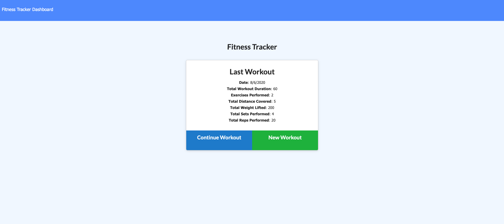
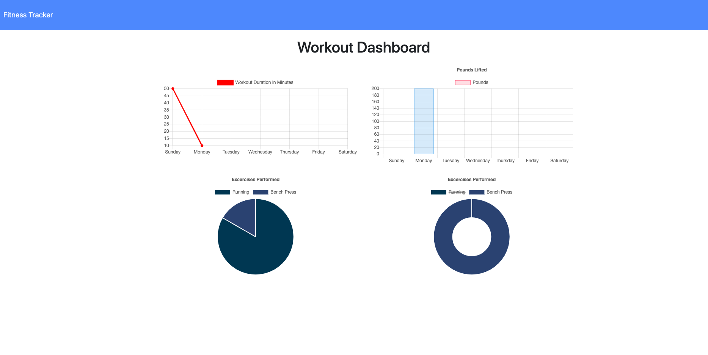

# Workout Tracker 

## Description 

> You can't manage what you cannot measure. 
> - Peter Drucker

Tracking workout progress is a proven method for reaching fitness goals faster. The Workout Tracker is an application designed to empower users on their fitness journey by creating and tracking daily workouts. 

Users are able to log multiple exercises in a workout on a given day. Based on the type of exercise, each entry can be tracked by the name, weight, sets, reps, distance, and duration of exercise. 

The application utilizes a JavaScript front-end and a Node.js backend. The noSQL database used is MongoDB with a Mongoose schema. 

Check out the deployed app on Heroku: 
[Workout Tracker](https://workouttracker123.herokuapp.com/)




### User Story
```
As a user
I want to be able to view create and track daily workouts
so that I can achieve my fitness goals
```

# Table of Contents
[Installation](#installation)

[Usage](#usage)

[Questions](#questions)

# Installation
** In order to use the application, the user will need to have mongoDB installed. 

** Once the repository has been forked and cloned, the user will need to change directories into the repository and run the command "npm install" in order to retrieve the neccessary dependencies. 

# Usage
** Once the application has been installed, the user will run "npm start" in the command line to initialize the server.

** In the server, the user can interact with the application to log and track workouts.


# Questions
For any questions, please connect with me:

Github username: @Jacquelineadean

Github URL: [GitHub](https://github.com/jacquelineadean/)

LinkedIn: [LinkedIn](https://www.linkedin.com/in/jacqueline-dean-968a66150/)

Email: Jacquelineadean@gmail.com